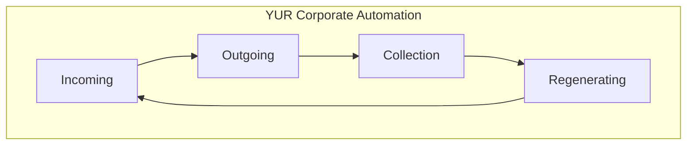

# YUR Corporate Automation

**The full system. The circle never stops.**

*Incoming → Outgoing → Collection → Regenerating → Incoming.*

AI-enhanced business automation that removes toil while keeping humans in control. Built for construction — land speculation through warranty. Built for any business. Verified. Audited.

📄 **[Marketing & Campaign Copy](docs/YUR_CORPORATE_AUTOMATION.md)** · 📐 **[Architecture Wireframe](docs/WIREFRAME.md)** · ✅ **[Verification](docs/VERIFICATION.md)**

## 🚀 What FranklinOps Does

### **Core Capabilities**
- **🧠 AI-Powered Business Intelligence**: Ask questions about your business in plain English
- **⚡ Smart Automation**: Sales pipeline management, invoice processing, cash flow monitoring
- **🎯 Proactive Issue Detection**: Built-in customer service that prevents problems before they occur
- **📊 Document Intelligence**: Automatically organize, search, and extract insights from all your business documents
- **🔔 Smart Notifications**: Context-aware alerts that help you stay on top of critical business activities

### **The Circle: YUR Corporate Automation**



*Incoming → Outgoing → Collection → Regenerating → Incoming. Hub = Collection. Regenerating closes the loop.*

## 🎯 Key Features

### **Sales Automation (SalesSpokes)**
- **Lead Capture**: Automatically detect new opportunities from emails and folders
- **Pipeline Management**: Track bid deadlines, follow-up tasks, and opportunity stages
- **Outbound Email**: AI-assisted email drafting with approval workflows
- **Contact Deduplication**: Maintain clean, organized contact records

### **Finance Automation (FinanceSpokes)**
- **AP Intake**: Automatic invoice parsing and approval routing
- **Cash Flow Forecasting**: Import spreadsheets and generate predictive alerts
- **AR Follow-up**: Automated payment reminders with human oversight
- **Procore Integration**: Sync project data and financial information

### **Intelligence & Search**
- **Document Chat**: Ask questions like "Which vendors haven't been paid?" 
- **Vector Search**: Find any document, email, or record across all your files
- **Business Insights**: Get real-time analysis of your business performance
- **Change Detection**: Know exactly what files changed since last scan

## 🏗️ Perfect for Construction & Contracting

**Built specifically for construction workflows:**
- Monitor bidding folders for new ITBs and RFQs
- Track project deadlines and submission requirements
- Manage vendor relationships and payment schedules
- Integrate with Procore for comprehensive project management
- Handle complex cash flow forecasting with waterfall analysis

## 🛡️ Security & Governance

### **Local-First Architecture**
- All sensitive data stays on your computer
- Optional cloud AI for document processing (OpenAI integration)
- Cryptographic signatures for all automated actions
- Complete audit trail of every system operation

### **Human Control**
- **Shadow Mode**: AI drafts everything, you approve
- **Assist Mode**: AI handles routine tasks, escalates important decisions
- **Autopilot Mode**: Trusted workflows run automatically with sampling

## 🚀 Quick Start

### **Prerequisites**
- Python 3.11+
- Windows 10/11 (tested) or Linux/macOS
- OneDrive or local document folders
- Optional: OpenAI API key for enhanced AI features

### **Installation**

1. **Clone the repository:**
```bash
git clone https://github.com/YUR-AI-CREATIONS/yur-automation.git
cd yur-automation
```

2. **Install dependencies:**
```bash
pip install -r requirements-minimal.txt
```

3. **Configure your environment:**
```bash
cp .env.example .env
# Edit .env with your folder paths and preferences
```

4. **Start the system:**
```bash
python -m uvicorn src.franklinops.server:app --host 127.0.0.1 --port 8000
```

5. **Access the enhanced interface:**
Open http://127.0.0.1:8000/ui/enhanced in your browser

### **Configuration**

Edit `.env` to configure your business:

```env
# Your OneDrive folder paths
FRANKLINOPS_ONEDRIVE_PROJECTS_ROOT=C:\Users\YourName\OneDrive\01PROJECTS
FRANKLINOPS_ONEDRIVE_BIDDING_ROOT=C:\Users\YourName\OneDrive\02BIDDING
FRANKLINOPS_ONEDRIVE_ATTACHMENTS_ROOT=C:\Users\YourName\OneDrive\Attachments

# OpenAI for enhanced AI features (optional)
OPENAI_API_KEY=sk-your-openai-key-here

# Email integration (optional)
FRANKLINOPS_EMAIL_PROVIDER=gmail
FRANKLINOPS_FROM_EMAIL=your-email@company.com
```

## 💼 Business Impact

### **Immediate Benefits**
- **90% reduction** in manual data entry
- **5+ hours saved per week** through automation
- **Zero missed deadlines** with proactive alerts
- **Complete visibility** into business operations

### **ROI Examples**
- **Lead Processing**: 30 minutes → 3 minutes (90% time savings)
- **Invoice Management**: 15 minutes → 2 minutes (87% time savings)
- **Document Search**: 20 minutes → 30 seconds (98% time savings)
- **Follow-up Tasks**: 45 minutes → 5 minutes (89% time savings)

## 🔧 Advanced Features

### **AI-Enhanced User Experience**
- **Conversational Interface**: Natural language business queries
- **Smart Onboarding**: 5-minute setup with intelligent business type detection
- **Proactive Customer Service**: Built-in issue detection and resolution
- **Success Coaching**: Celebrates achievements and suggests optimizations

### **Enterprise-Grade Features**
- **Comprehensive Audit Trail**: Every action logged with evidence
- **Approval Workflows**: Configurable governance for all automations
- **Rate Limiting**: Prevent runaway automation
- **Rollback Capability**: Undo any automated action
- **Multi-Mode Operation**: Shadow → Assist → Autopilot progression

## 📊 System Architecture

### **Hub Components**
- **OpsDB**: Local SQLite database with all business entities
- **DocIndex**: FAISS vector search with document birthmarking
- **AutonomyGate**: Governance engine with HMAC signatures
- **AuditLog**: Comprehensive activity tracking
- **UI**: Modern, responsive web interface

### **Spokes (Automation Modules)**
- **SalesSpokes**: Lead management and pipeline automation
- **FinanceSpokes**: Invoice processing and cash flow management
- **Future Spokes**: Scheduling, safety, estimating (roadmap)

### **Tire (Evolution Loop)**
- **Metrics**: ROI tracking and performance analysis
- **Backlog**: Automated prioritization of new automation opportunities
- **Evolution**: Continuous improvement of workflows and prompts

## 🛠️ Development

### **Project Structure**
```
src/franklinops/
├── server.py              # FastAPI server and UI
├── opsdb.py               # Database operations
├── sales_spokes.py        # Sales automation
├── finance_spokes.py      # Finance automation
├── ops_chat.py            # AI-powered business chat
├── onboarding.py          # Smart user onboarding
├── customer_service.py    # Proactive issue detection
├── smart_notifications.py # Context-aware alerts
├── doc_ingestion.py       # Document processing
├── doc_index.py           # Vector search and indexing
└── autonomy.py            # Governance and approvals
```

### **API Endpoints**
- `/ui/enhanced` - Modern conversational interface
- `/api/ops_chat` - AI-powered business intelligence
- `/api/pilot/run` - Run complete automation cycle
- `/api/onboarding/*` - Smart setup and guidance
- `/api/support/*` - Proactive customer service
- `/api/notifications/*` - Smart notification system

## 🔮 Roadmap

### **Phase 2: Advanced Integrations**
- QuickBooks/Sage accounting integration
- Advanced Procore API features
- Mobile app for approvals and monitoring
- Team collaboration features

### **Phase 3: AI Enhancement**
- Voice commands and responses
- Predictive analytics dashboard
- Custom workflow builder
- Advanced reporting suite

## 📖 Documentation

### **User Guides**
- [Getting Started Guide](docs/getting-started.md) - Step-by-step setup
- [Business Configuration](docs/configuration.md) - Customize for your business
- [Automation Workflows](docs/workflows.md) - Understanding the automation

### **Technical Documentation**
- [API Reference](docs/api.md) - Complete endpoint documentation
- [Architecture Guide](docs/architecture.md) - System design and components
- [Development Setup](docs/development.md) - Contributing to FranklinOps

## 🤝 Contributing

We welcome contributions! Please see our [Contributing Guide](CONTRIBUTING.md) for details.

## 📄 License

This project is licensed under the MIT License - see the [LICENSE](LICENSE) file for details.

## 🏢 Use Cases

### **Construction & Contracting**
- Bid management and deadline tracking
- Project documentation organization
- Vendor payment scheduling
- Cash flow monitoring with waterfall analysis

### **Professional Services**
- Client relationship management
- Project deadline tracking
- Invoice automation and follow-up
- Time and billing optimization

### **Small Business Operations**
- Document organization and search
- Task and deadline management
- Financial tracking and reporting
- Customer communication automation

## 🆘 Support

- **Documentation**: Comprehensive guides and API docs
- **Built-in Help**: Proactive customer service system
- **Community**: GitHub Issues and Discussions
- **Enterprise Support**: Contact for custom implementations

## 🎯 Why FranklinOps?

> **"The goal is not to replace humans, but to gracefully remove human toil while keeping humans in control for high-risk decisions."**

FranklinOps represents a new paradigm in business automation:
- **Revolutionary but Usable**: Cutting-edge AI that anyone can use
- **Transitionable**: Gradual automation increase as trust builds
- **Human-Graceful**: Humans become reviewers and decision-makers, not data entry clerks
- **Local-First**: Your data stays under your control
- **Audit-Ready**: Complete transparency and rollback capability

**Transform your business operations with the pinnacle of user-friendly automation.** 🚀

---

*Built with ❤️ for businesses that want to focus on what matters most.*