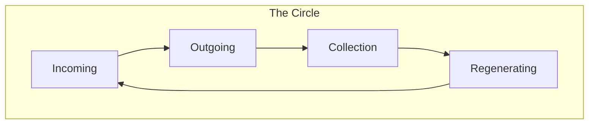

# FranklinOps / Trinity — Architecture

**Enterprise automation platform with universal flow plug-in.**

---

## Runtime Kernel

The **Runtime Kernel** (`src/core/kernel.py`) is the minimal substrate everything runs on:

- **Boot** → init DB, migrations, audit, governance, flow registry
- **Invoke** → core syscall: dispatch flows with hardening (rate limit, circuit breaker, sanitize, audit)
- **Shutdown** → close DB, audit final event

| Concept | Kernel Analogy |
|---------|----------------|
| Kernel | `RuntimeKernel` |
| Process | Flow |
| Syscall | `kernel.invoke(flow_id, inp)` |
| Driver | HTTP server, CLI, etc. |

The HTTP server is a **driver** on top of the kernel. Sales, Finance, GROKSTMATE are **flows** or **spokes** that plug in.

---

## System Overview

| Phase | Role | Components |
|-------|------|------------|
| **Incoming** | Data, documents, leads | DocIngestion, Trinity Sync, Procore, BID-ZONE |
| **Outgoing** | Emails, reports, approvals | SalesSpokes, FinanceSpokes, Approvals |
| **Collection** | Store, index, audit | OpsDB, DocIndex, Audit |
| **Regenerating** | Metrics, backlog, evolution | Metrics, Tire, Onboarding |

---

## Universal Flow Interface

Any system with **IN** and **OUT** can plug in:

- **FlowRegistry**: Thread-safe registry of flows
- **FlowSpec**: flow_id, direction, scope, timeout
- **FlowHandler**: process(inp) -> out
- **Hardening**: sanitize, rate limit, circuit breaker, retry, timeout, audit

---

## Enterprise Layers

| Layer | Purpose |
|-------|---------|
| **Multi-tenancy** | Tenant isolation via X-Tenant-ID |
| **RBAC** | Roles: admin, ops, viewer, service |
| **API versioning** | /api/v1/* → /api/* |
| **Governance** | 5 scopes, evidence gates, PQC |
| **Audit** | Append-only, configurable retention |

---

## Key Files

| Component | Path |
|-----------|------|
| **Runtime kernel** | `src/core/kernel.py` |
| Flow interface | `src/core/flow_interface.py` |
| Flow hardening | `src/core/flow_hardening.py` |
| Tenant context | `src/core/tenant.py` |
| Auth / RBAC | `src/core/auth.py` |
| Migrations | `src/franklinops/migrations.py` |
| Server | `src/franklinops/server.py` |
