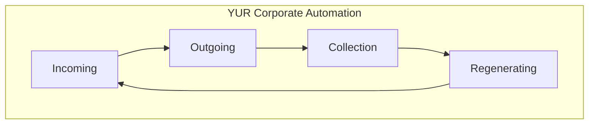
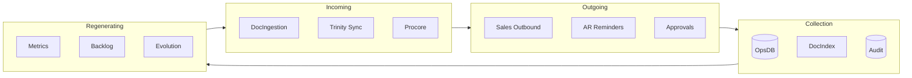
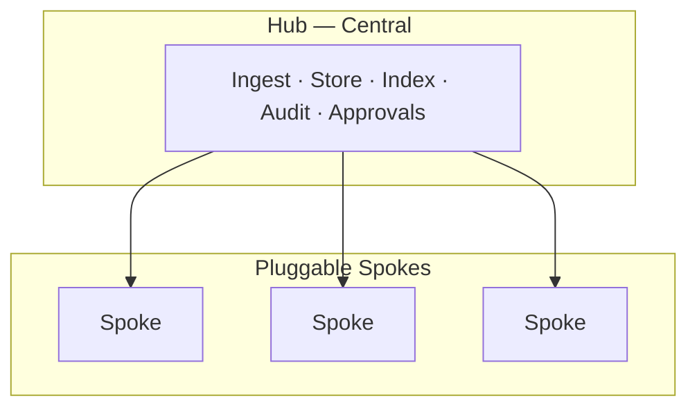
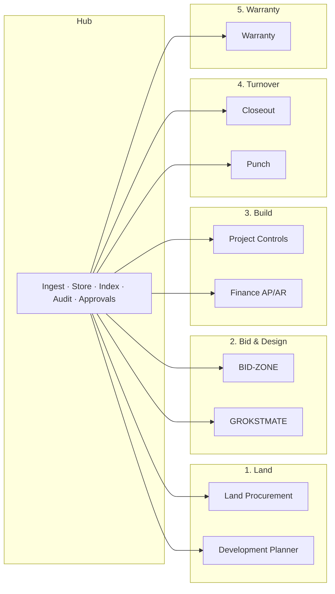

# YUR Corporate Automation — Wireframe

**Technical architecture for the full system.**

*Companion to [YUR_CORPORATE_AUTOMATION.md](YUR_CORPORATE_AUTOMATION.md) (marketing) and [CAMPAIGN_COPY.md](CAMPAIGN_COPY.md) (campaign assets).*

**The circle:** Incoming → Outgoing → Collection → Regenerating → Incoming.

**Status legend:** PLUGGED = wired and working | KNOWN = exists, not wired | GAP = find or build

---

## 1. The Circle



| Phase | Role |
|-------|------|
| **Incoming** | Data, documents, leads, invoices, events |
| **Outgoing** | Emails, reports, approvals, decisions, deliverables |
| **Collection** | Store, index, audit — the spine |
| **Regenerating** | Backlog, evolution, feedback — improves the loop |

*The circle closes. Regenerating feeds back into Incoming.*

---

## 2. Circle → Spine Mapping



*Incoming → Outgoing → Collection → Regenerating → Incoming. Hub = Collection. Regenerating closes the loop.*

---

## 3. Component Status Matrix

| Component | Status | Location | Notes |
|-----------|--------|----------|-------|
| **OpsDB** | PLUGGED | `src/franklinops/opsdb.py` | SQLite, all tables |
| **DocIndex** | PLUGGED | `src/franklinops/doc_index.py` | FAISS, RAG |
| **DocIngestion** | PLUGGED | `src/franklinops/doc_ingestion.py` | All roots |
| **Audit** | PLUGGED | `src/franklinops/audit.py` | Append-only |
| **Approvals** | PLUGGED | `src/franklinops/approvals.py` | Shadow/assist/autopilot |
| **AutonomyGate** | PLUGGED | `src/core/autonomy_gate.py` | Governance |
| **SalesSpokes** | PLUGGED | `src/franklinops/sales_spokes.py` | Leads, pipeline, outbound |
| **FinanceSpokes** | PLUGGED | `src/franklinops/finance_spokes.py` | AP, AR, cashflow |
| **GROKSTMATE** | PLUGGED | `src/integration/`, `GROKSTMATE/` | Estimate, project, bots |
| **Procore** | PLUGGED | `src/franklinops/integrations/procore.py` | OAuth, projects |
| **Trinity Sync** | PLUGGED | `src/franklinops/integrations/trinity_sync.py` | Leads (needs API key) |
| **Accounting** | PLUGGED | `src/franklinops/integrations/accounting.py` | CSV import/export |
| **Ops Chat** | PLUGGED | `src/franklinops/ops_chat.py` | RAG Q&A |
| **BID-ZONE** | KNOWN | d-XAI-BID-ZONE | Sales portal — ingestion only, no API bridge |
| **Franklin OS** | KNOWN | d-Franklin-OS-local | Ingestion only |
| **JCK Land Dev** | KNOWN | d-JCK-Land-Development | Ingestion only |
| **Project Controls** | PLUGGED | c-00-Project-Controls-* | 12 roots, ingestion |

---

## 4. API Wireframe (What Exists vs Gaps)

| Route | Status | Notes |
|-------|--------|-------|
| `GET /api/config` | PLUGGED | |
| `GET /api/autonomy` | PLUGGED | |
| `GET /api/approvals` | PLUGGED | |
| `GET /api/audit` | PLUGGED | |
| `GET /api/tasks` | PLUGGED | |
| `POST /api/ingest/run` | PLUGGED | |
| `POST /api/doc_index/rebuild` | PLUGGED | |
| `POST /api/ops_chat` | PLUGGED | |
| `GET/POST /api/sales/*` | PLUGGED | Leads, opps, outbound |
| `GET/POST /api/finance/*` | PLUGGED | AP, AR, cashflow, Procore |
| `GET/POST /api/grokstmate/*` | PLUGGED | Estimate, project |
| `POST /api/pilot/run` | PLUGGED | Full pilot |
| `GET /api/integrations/procore/*` | PLUGGED | OAuth, sync |
| `GET /api/integrations/accounting/*` | PLUGGED | Export/import |
| `GET /api/bidzone/status` | PLUGGED | Stub — bridge to build |
| `POST /api/bidzone/estimate` | PLUGGED | Stub — returns "not yet built" |
| `GET /api/project_controls/sources` | PLUGGED | Returns pc_* roots |
| `GET /api/project_controls/artifacts` | PLUGGED | Artifacts from pc_* sources |
| `GET /api/franklin_os/status` | PLUGGED | Stub — bridge to find |

---

## 5. UI Wireframe (What Exists vs Gaps)

| Route | Status | Notes |
|-------|--------|-------|
| `GET /ui` | PLUGGED | Home |
| `GET /ui/enhanced` | PLUGGED | Conversational UI |
| `GET /ui/ops` | PLUGGED | Tasks, approvals |
| `GET /ui/sales` | PLUGGED | Pipeline, leads |
| `GET /ui/finance` | PLUGGED | AP, AR, cashflow |
| `GET /ui/grokstmate` | PLUGGED | Estimate, project |
| `GET /ui/rollout` | PLUGGED | Pilot, metrics |
| `GET /ui/bidzone` | PLUGGED | Stub — next: inspect franklin_os.py |
| `GET /ui/project_controls` | PLUGGED | Artifact viewer from pc_* |
| `GET /ui/land_dev` | GAP | JCK Land Dev view |

---

## 6. Hub-Spoke Map



*Other industries: plug your spokes. Construction example below.*

---

## 7. Construction Example — Full Lifecycle

*Land speculation → new home construction → turnover → warranty. All phases plug into the Hub.*



### Phase mapping (from docs)

| Phase | Spokes / Roots | Sources |
|-------|----------------|--------|
| **1. Land speculation** | Land Procurement, Development Planner, JCK Land Dev | Market analysis, feasibility, environmental Phase 1, financial proforma, zoning, 5 layouts, 2D/3D, geotech |
| **2. Bid & design** | BID-ZONE, GROKSTMATE, 02BIDDING | ITBs, RFQs, estimating, CSI takeoff, value engineering |
| **3. Build** | Project Controls (12 logs), FinanceSpokes | Change order, RFI, submittal, material delivery, rain delay, AP/AR, Procore |
| **4. Turnover** | Document Log, 01PROJECTS | Closeout, punch list, final walkthrough |
| **5. Warranty** | Document Log, Attachments | Warranty claims, service calls |

*Roots: `hub_config.py`, `TRACKABLE_STRUCTURE.md`. Agents: `ModelOrchestrator.tsx`, BID-ZONE `ARCHITECTURE.md`.*

### Verification (proof it works)

```powershell
python scripts/verify_integration.py
```

| Verified | Result |
|----------|--------|
| CostEstimator | $310K–$782K estimates |
| ProjectManager | 8 tasks per plan |
| Integration Bridge | estimate_project, create_project_plan |
| Governance Adapter | +1 audit event per estimate |
| Pilot run | GROKSTMATE phase completes |
| GROKSTMATE tests | 4/4 pass (Cost, Project, TaskAgent, BotDeployment) |

See [docs/VERIFICATION.md](VERIFICATION.md) for full report.

---

## 8. Gaps — To Find or Build

### High Priority

| Gap | Action | Notes |
|-----|--------|-------|
| **BID-ZONE API bridge** | Find or build | Stub at `/api/bidzone/*`. Inspect `d-XAI-BID-ZONE/src/interfaces/franklin_os.py` |
| **BID-ZONE → FranklinOps lead flow** | Build | When BID-ZONE creates estimate, create SalesSpokes lead/opportunity |
| **FranklinOps → BID-ZONE trigger** | Build | From SalesSpokes opportunity, trigger BID-ZONE estimate |

### Medium Priority

| Gap | Action | Notes |
|-----|--------|-------|
| **Project Controls API** | Build | CRUD for PC logs (RFI, CO, Submittal, etc.) |
| **PC → Finance sync** | Build | Change orders, RFIs → invoices/approvals |
| **Franklin OS bridge** | Find | Inspect d-Franklin-OS-local for API/orchestration |
| **JCK Land Dev integration** | Find | Inspect d-JCK-Land-Development |

### Lower Priority

| Gap | Action | Notes |
|-----|--------|-------|
| **GROKSTMATE ↔ BID-ZONE** | Build | Share estimates; BID-ZONE has richer plan ingestion |
| **OneDrive roots** | Configure | Set env vars if using OneDrive |
| **Trinity API key** | Configure | For lead sync |

---

## 9. Next Steps

1. **Inspect BID-ZONE** — Open `d-XAI-BID-ZONE/src/interfaces/franklin_os.py`, map API surface
2. **Build BID-ZONE bridge** — Add `src/integration/bidzone_bridge.py` and `/api/bidzone/*` routes
3. **Add BID-ZONE UI** — `/ui/bidzone` — embed or link to BID-ZONE
4. **Project Controls API** — Add `/api/project_controls/*` for log CRUD
5. **Inspect Franklin OS** — Map d-Franklin-OS-local structure
