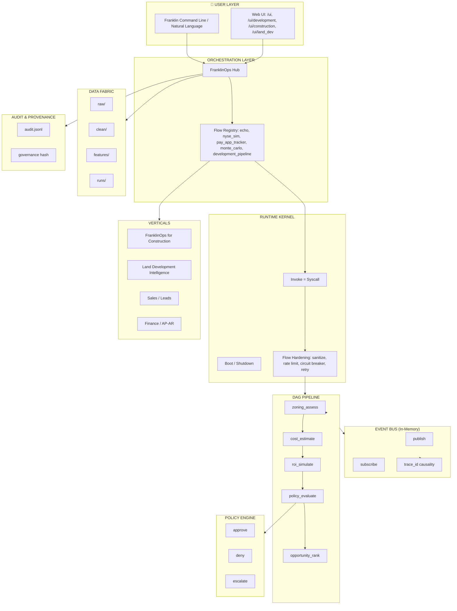
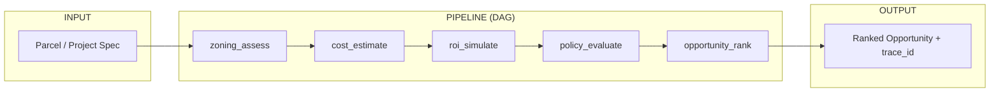
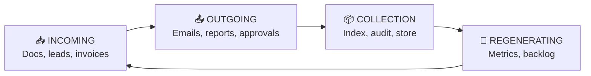
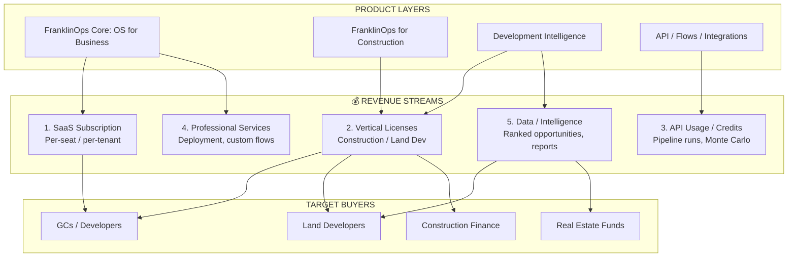
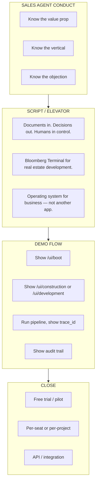
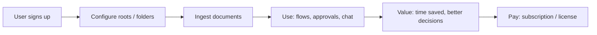
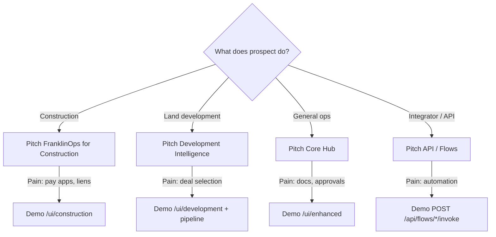

# FranklinOps — Expanded Workflow Wireframe, Monetization Path & Sales Agent Playbook

**Mermaid-style diagrams + monetizable path + how to conduct agents to sell it.**

---

## 1. Full System Workflow (Mermaid)

---

## 2. Development Pipeline Flow (Land Deal)

---

## 3. The Circle (Incoming → Outgoing → Collection → Regenerating)

---

## 4. Monetizable Path

### Monetization Summary

| Path | What | Who Pays | Price Signal |
|------|------|----------|--------------|
| **SaaS** | Hub + flows + audit | GCs, developers | $X/seat/month |
| **Construction** | Pay app tracker, dashboard, lien deadlines | Construction PMs, finance | $Y/project or $Z/tenant |
| **Land Dev** | Pipeline, Monte Carlo, policy, ranked opportunities | Land developers, funds | $A/run or $B/month |
| **API** | Invoke flows, pipeline, trace replay | Integrators, partners | $C/credit |

---

## 5. Sales Agent Playbook — How to Conduct Agents to Sell It

### Agent Conduct Rules

| Rule | Instruction |
|------|-------------|
| **1. Lead with value** | "Saves 10+ hours/week on pay apps and lien tracking" (Construction) or "Ranks the top 1% of deals with probability, not gut guess" (Land Dev) |
| **2. Use the tagline** | "Documents in. Decisions out. Humans in control." |
| **3. Differentiate** | "Not an app — an operating system. Everything plugs in. Everything is audited." |
| **4. Demo first** | Show `/ui/construction` or `/ui/development` before slides. |
| **5. Prove traceability** | "Every decision has a trace_id. You can replay causality." |
| **6. Offer pilot** | "Run it on one project. We'll prove ROI before you commit." |

### Vertical-Specific Scripts

**Construction (GCs, PMs):**
- "FranklinOps for Construction tracks pay apps, lien deadlines, and contract value. One dashboard. No spreadsheets."

**Land Development (Developers, Funds):**
- "Development Intelligence runs the full pipeline: parcel → zoning → cost → Monte Carlo → policy. You get ranked opportunities with probabilities, not guesses."

**Finance (AP/AR, Controllers):**
- "Invoice intake, cash flow forecasting, AR reminders. All integrated. All audited."

---

## 6. End-to-End Flow (User → Money)

---

## 7. Agent Decision Tree (When to Pitch What)

---

## 8. Quick Reference

| Item | URL / Command |
|------|---------------|
| **Download (Red Carpet)** | http://127.0.0.1:8844/ui/download — one-click zip, launcher scripts |
| Boot screen | http://127.0.0.1:8844/ui/boot |
| Main UI | http://127.0.0.1:8844/ui/enhanced |
| **Onboard Concierge** | 🛎️ button on home, construction, development, land_dev, enhanced — walk-through, navigate, approvals, component status |
| Construction | http://127.0.0.1:8844/ui/construction |
| Development | http://127.0.0.1:8844/ui/development |
| Land Dev | http://127.0.0.1:8844/ui/land_dev |
| **Ollama (Local AI)** | Auto-used when no OpenAI key. 2 steps: ollama.com → ollama pull llama3 |
| API docs | http://127.0.0.1:8844/docs |
| Verify | `python scripts/verify_integration.py` |

---

**To view Mermaid diagrams:** Paste into [Mermaid Live Editor](https://mermaid.live) or use VS Code with Mermaid extension.
