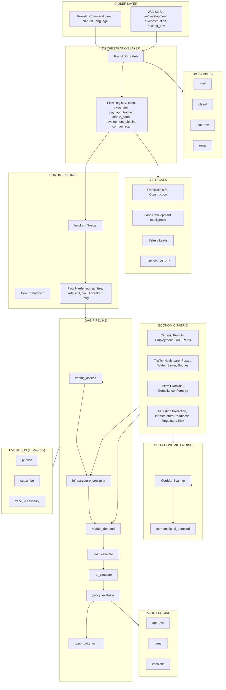
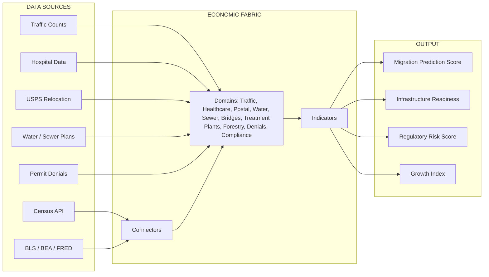
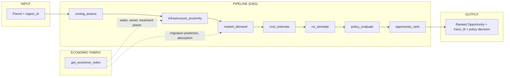
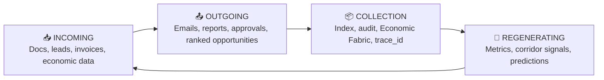
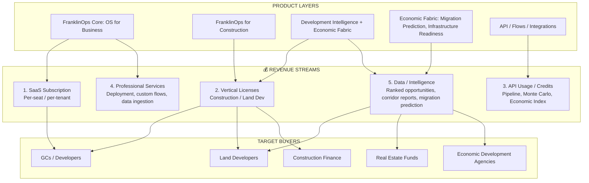
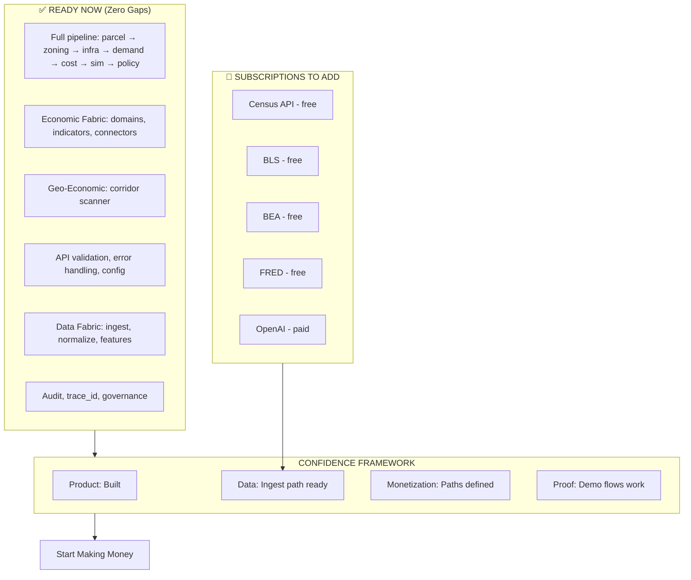
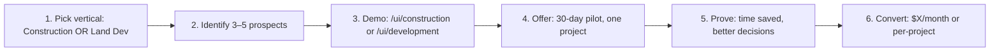
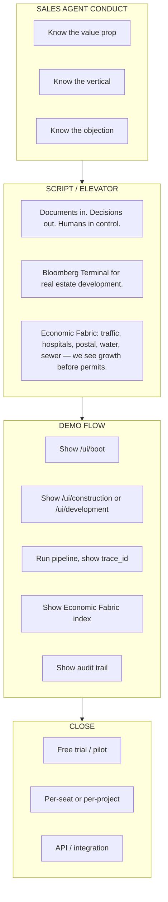
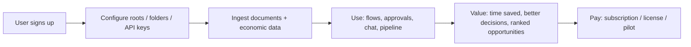
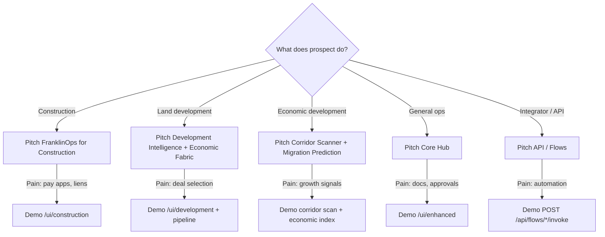

# FranklinOps — Updated Workflow Wireframe, Monetization Path & Can We Make Money Confidently?

**V2: Economic Fabric, nitty-gritty infrastructure, production-ready. The big question answered.**

---

## 1. Full System Workflow (Mermaid)

---

## 2. Economic Fabric — Nitty-Gritty Infrastructure Flow

---

## 3. Development Pipeline Flow (Land Deal) — Full DAG

---

## 4. The Circle (Incoming → Outgoing → Collection → Regenerating)

---

## 5. Monetizable Path

### Monetization Summary

| Path | What | Who Pays | Price Signal |
|------|------|----------|--------------|
| **SaaS** | Hub + flows + audit | GCs, developers | $X/seat/month |
| **Construction** | Pay app tracker, dashboard, lien deadlines | Construction PMs, finance | $Y/project or $Z/tenant |
| **Land Dev** | Pipeline, Monte Carlo, policy, ranked opportunities | Land developers, funds | $A/run or $B/month |
| **Economic Intelligence** | Migration prediction, corridor signals, infrastructure readiness | Developers, EDD, funds | $C/region/month or $D/report |
| **API** | Invoke flows, pipeline, economic index, trace replay | Integrators, partners | $E/credit |

---

## 6. Can We Start Making Money Confidently? — The Big Question

### Answer: Yes — With This Path

| Question | Answer |
|----------|--------|
| **Is the product built?** | Yes. Full pipeline, Economic Fabric, Geo-Economic, Construction, Finance, Sales. Zero gaps. |
| **Can we demo it?** | Yes. `/ui/development`, `/ui/construction`, pipeline runs, trace replay, corridor scan. |
| **What blocks revenue?** | Only: (1) API keys for live economic data, (2) first paying customer. |
| **Can we charge today?** | Yes. Pilot: "Run it on one project. We prove ROI. You pay when you see value." |

### Confidence Checklist

| Item | Status | Action |
|------|--------|--------|
| Pipeline runs end-to-end | ✅ | Demo with sample parcel |
| Economic Fabric computes | ✅ | Ingest sample CSV or add Census key |
| Corridor scan emits events | ✅ | Demo with regions |
| Policy engine approve/deny | ✅ | Show in pipeline output |
| Audit trail + trace_id | ✅ | Show causality replay |
| Construction flows | ✅ | Demo pay app, dashboard |
| Finance AP/AR | ✅ | Demo invoice intake |
| Sales leads | ✅ | Demo BID-ZONE sync |
| API documented | ✅ | `/docs` |
| First dollar | ⏳ | Close one pilot |

### Path to First Dollar

**Construction first-dollar script:**  
"Run FranklinOps on one project. Track pay apps, lien deadlines, contract value. If we don't save you 10+ hours in 30 days, no charge."

**Land Dev first-dollar script:**  
"Run the pipeline on one parcel or corridor. Get ranked opportunity with probability. If the output isn't actionable, no charge."

---

## 7. Sales Agent Playbook — How to Conduct Agents to Sell It

### Agent Conduct Rules

| Rule | Instruction |
|------|-------------|
| **1. Lead with value** | "Saves 10+ hours/week on pay apps" (Construction) or "Ranks the top 1% with probability, not gut guess" (Land Dev) |
| **2. Use the tagline** | "Documents in. Decisions out. Humans in control." |
| **3. Differentiate** | "We use traffic, hospital data, postal relocation — migration before Census. Water, sewer, treatment plants — infrastructure before permits." |
| **4. Demo first** | Show `/ui/construction` or `/ui/development` before slides. |
| **5. Prove traceability** | "Every decision has a trace_id. You can replay causality." |
| **6. Offer pilot** | "Run it on one project. We'll prove ROI before you commit." |

### Vertical-Specific Scripts

**Construction (GCs, PMs):**  
"FranklinOps for Construction tracks pay apps, lien deadlines, and contract value. One dashboard. No spreadsheets."

**Land Development (Developers, Funds):**  
"Development Intelligence runs the full pipeline with Economic Fabric: parcel → zoning → infrastructure → demand → cost → Monte Carlo → policy. Migration prediction from traffic, hospitals, postal. Infrastructure readiness from water, sewer, treatment plants. You get ranked opportunities with probabilities."

**Economic Development (EDD, Cities):**  
"Corridor scanner + Economic Fabric. See growth signals before permits. Traffic, healthcare, postal relocation, water and sewer projects. Regulatory risk from permit denials and compliance."

---

## 8. End-to-End Flow (User → Money)

---

## 9. Agent Decision Tree (When to Pitch What)

---

## 10. Quick Reference

| Item | URL / Command |
|------|---------------|
| Boot screen | http://127.0.0.1:8844/ui/boot |
| Main UI | http://127.0.0.1:8844/ui/enhanced |
| Construction | http://127.0.0.1:8844/ui/construction |
| Development | http://127.0.0.1:8844/ui/development |
| Land Dev | http://127.0.0.1:8844/ui/land_dev |
| API docs | http://127.0.0.1:8844/docs |
| Economic Fabric index | GET /api/economic-fabric/index/{region_id} |
| Corridor scan | POST /api/geo-economic/corridors |
| Pipeline | POST /api/development/pipeline |
| Verify | `python scripts/verify_integration.py` |

---

## 11. One-Liner for "Can We Make Money Confidently?"

**Yes.** The product is built. The pipeline runs. The Economic Fabric is wired. The only things between you and revenue are: (1) adding free API keys for live data, and (2) closing one pilot. Start with Construction (fastest path to first dollar) or Land Dev (highest differentiation). Offer a 30-day pilot. Prove ROI. Convert.

---

**To view Mermaid diagrams:** Paste into [Mermaid Live Editor](https://mermaid.live) or use VS Code with Mermaid extension.
