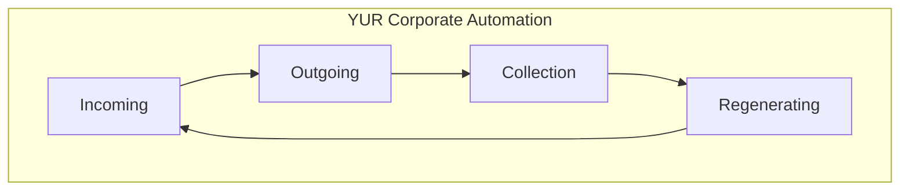

# YUR Corporate Automation

**The full system. The circle never stops.**

---

## Broadcast-Ready

This document is prepared for marketing campaigns. It includes:
- Tagline and one-liners
- The Circle (architecture)
- Proof (verification results)
- Construction example (full lifecycle)
- Campaign copy references
- Quick start

Use [CAMPAIGN_COPY.md](CAMPAIGN_COPY.md) for copy-paste assets. Use [WIREFRAME.md](WIREFRAME.md) for technical detail.

---

## Tagline

*AI-enhanced business automation that removes toil while keeping humans in control. Built for construction. Built for any business.*

---

## The Circle

YUR Corporate Automation is a closed-loop system. Four phases. One continuous flow.



| Phase | What It Does |
|-------|--------------|
| **Incoming** | Documents, leads, invoices, events — everything that arrives |
| **Outgoing** | Emails, reports, approvals, decisions — everything that leaves |
| **Collection** | Store, index, audit. The spine. Nothing is lost. |
| **Regenerating** | Metrics, backlog, evolution. The system improves itself. |

**The circle closes.** Regenerating feeds back into Incoming. The loop runs continuously.

---

## Why a Circle?

Most automation is linear: input → process → output. Done.

YUR Corporate Automation is **regenerative**. What goes out gets collected. What gets collected drives improvement. Improvement makes the next incoming cycle smarter. The system compounds.

---

## Proof It Works

We run live verification on every integration. No hand-waving.

| Verified | Result |
|----------|--------|
| Cost estimation | $310K–$782K per project |
| Project planning | 8 tasks per plan, automated |
| Integration bridge | FranklinOps ↔ GROKSTMATE |
| Governance | Every action audited |
| Full pilot | Ingest, sales, finance, GROKSTMATE — one run |

**9 tests. 0 failures.** Run `python scripts/verify_integration.py` yourself.

---

## Construction Example: Full Lifecycle

YUR Corporate Automation’s reference implementation spans the entire construction lifecycle.

| Phase | What’s Covered |
|-------|----------------|
| **1. Land speculation** | Market analysis, feasibility, environmental Phase 1, financial proforma, zoning, 5 layout options, 2D/3D, geotech |
| **2. Bid & design** | ITBs, RFQs, estimating, CSI takeoff, value engineering |
| **3. Build** | Change orders, RFIs, submittals, material delivery, rain delay, AP/AR, Procore |
| **4. Turnover** | Closeout, punch list, final walkthrough |
| **5. Warranty** | Warranty claims, service calls |

**Land speculation → new home construction → turnover → warranty.** All phases plug into the same Hub. Same circle.

---

## The Hub

The Hub is **Collection**. It never changes for the business.

- **Ingest** — Documents, APIs, sync
- **Store** — OpsDB, artifacts, audit
- **Index** — Vector search, RAG
- **Audit** — Every action logged
- **Approvals** — Human-in-the-loop when it matters

Industry specifics live in **Spokes**. Construction: SalesSpokes, FinanceSpokes, GROKSTMATE, BID-ZONE. Other industries: plug your spokes.

---

## Human Control

- **Shadow** — AI drafts. You approve.
- **Assist** — AI handles routine. Escalates the rest.
- **Autopilot** — Trusted workflows run. You sample.

The goal is not to replace humans. It’s to remove toil and keep humans in control for high-risk decisions.

---

## Quick Start

```bash
pip install -e GROKSTMATE
python -m src.franklinops.run_pilot
python -m uvicorn src.franklinops.server:app --host 0.0.0.0 --port 8844
```

Open http://localhost:8844/ui

---

## For Marketing Use

**One-liner:** *YUR Corporate Automation — the full system. Incoming, Outgoing, Collection, Regenerating. The circle never stops.*

**LinkedIn:** *Built YUR Corporate Automation: a regenerative business automation system. Four phases — Incoming, Outgoing, Collection, Regenerating — in a closed loop. Construction lifecycle from land speculation through warranty. Verified. Audited. Human-in-control.*

**Technical:** *Hub-spoke architecture. Collection = spine. Spokes = industry-specific. Construction example: Land, Bid, Build, Turnover, Warranty. 9/9 verification tests pass.*

---

## Campaign Assets

- **[CAMPAIGN_COPY.md](CAMPAIGN_COPY.md)** — Taglines, LinkedIn posts, email subjects, pitch bullets
- **[WIREFRAME.md](WIREFRAME.md)** — Technical architecture, component matrix, API wireframe
- **[VERIFICATION.md](VERIFICATION.md)** — Live test results, how to run verification

---

*YUR Corporate Automation. FranklinOps. GROKSTMATE. BID-ZONE. Built by YUR-AI-CREATIONS.*
